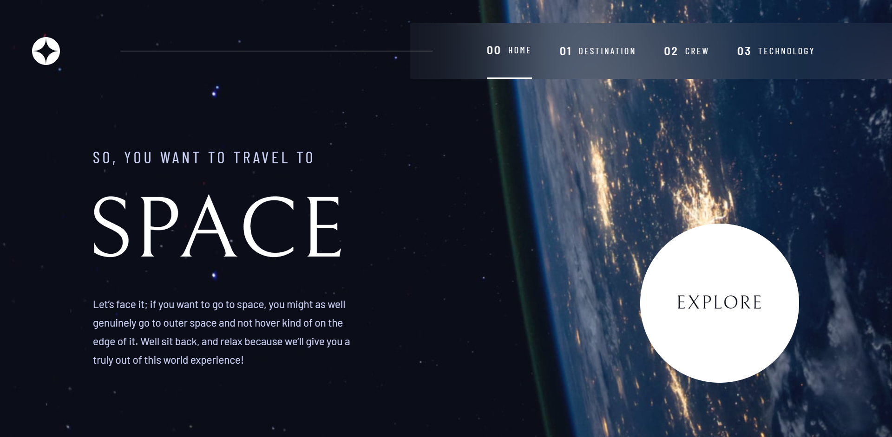

# Frontend Mentor - Space tourism website solution

This is a solution to the [Space tourism website challenge on Frontend Mentor](https://www.frontendmentor.io/challenges/space-tourism-multipage-website-gRWj1URZ3). Frontend Mentor challenges help you improve your coding skills by building realistic projects. 

## Table of contents

- [Overview](#overview)
  - [The challenge](#the-challenge)
  - [Screenshot](#screenshot)
  - [Links](#links)
  - [Built with](#built-with)
- [Author](#author)

## Overview

### The challenge

Users should be able to:

- View the optimal layout for each of the website's pages depending on their device's screen size
- See hover states for all interactive elements on the page
- View each page and be able to toggle between the tabs to see new information

### Screenshot

### Links

- Solution URL: https://www.frontendmentor.io/solutions/space-tourism-using-react-and-styledcomponents-KoWCZtvzql
- Live Site URL: https://space-tourismm.vercel.app/

## My process

### Built with

- Mobile-first workflow
- [React](https://reactjs.org/) - JS library
- [Styled Components](https://styled-components.com/) - For styles

## Author

- Website - [Mike Arvene Lantin](https://arvene.live/)
- Frontend Mentor - [@arvene241](https://www.frontendmentor.io/profile/arvene241)
- Twitter - [@arvenelantin](https://twitter.com/arvenelantin)
